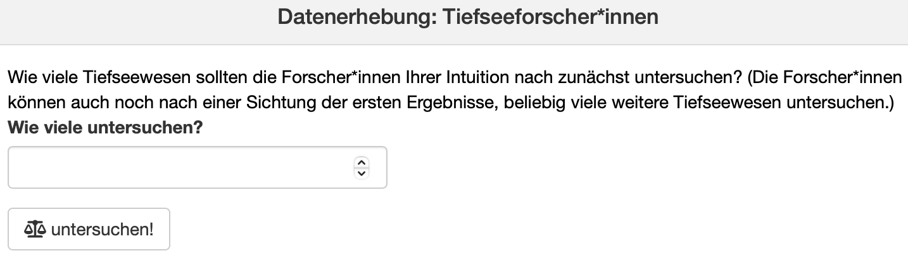
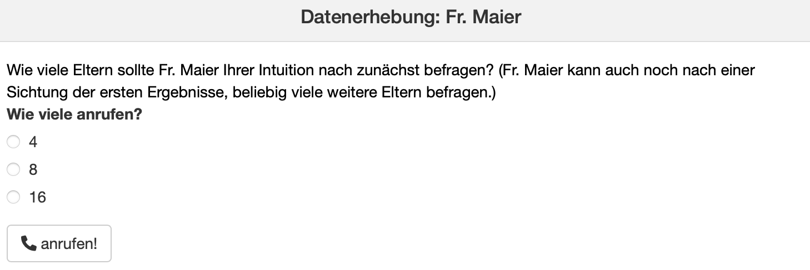
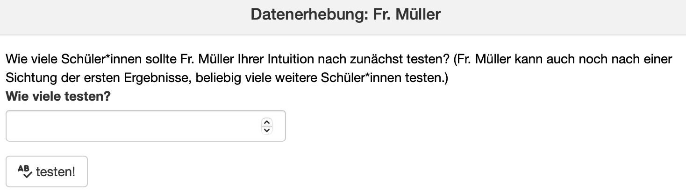
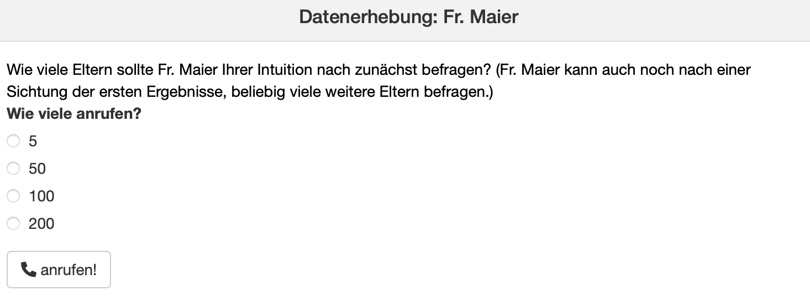
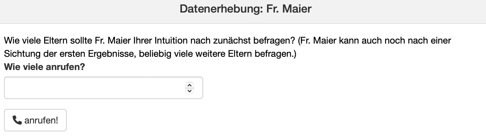
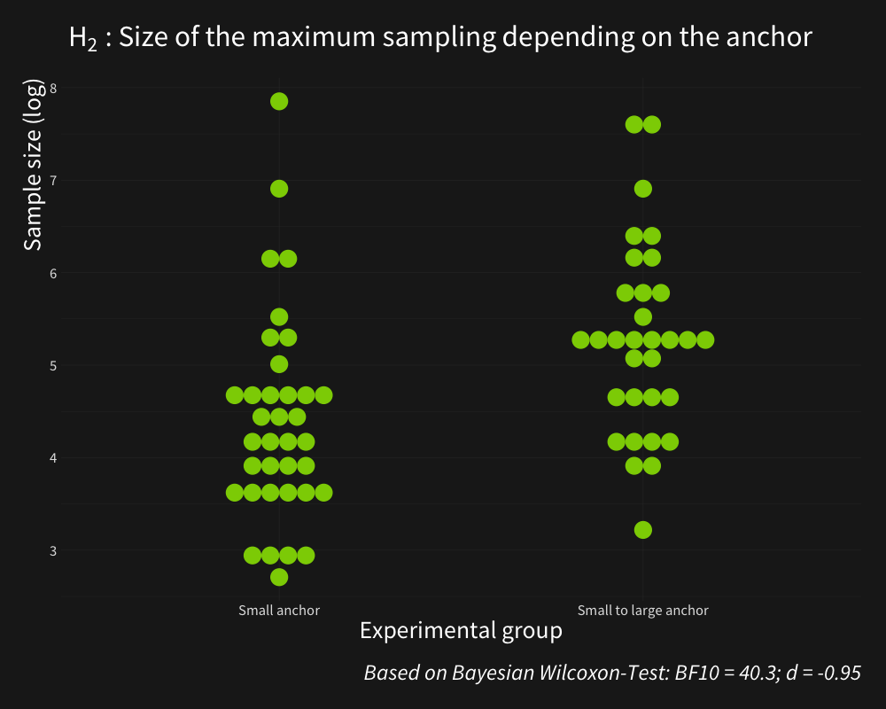
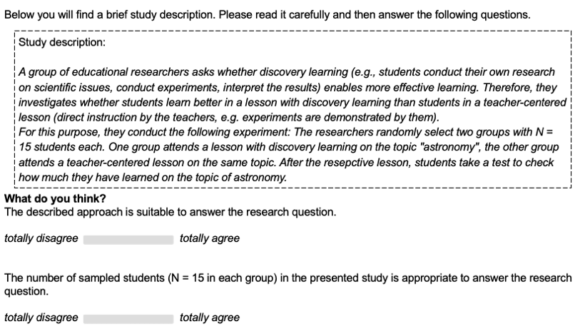

---
output:
  xaringan::moon_reader:
    css: xaringan-themer.css
    lib_dir: libs
    seal: false
    nature:
      highlightStyle: github
      highlightLines: true
      countIncrementalSlides: false
      ratio: "16:9"
---

name: title
class: center, middle, hide_logo

```{r, eval=FALSE, echo = F}
dir.create("style_file")
```

```{r xaringen-themer, echo=F, warning=FALSE, message=FALSE}
#install.packages("xaringan")
#install.packages("xaringanthemer")
#library(xaringanthemer)
#style_mono_light(
#  base_color = "#001c05",
#  header_font_google = google_font("Times New Roman"),
#  text_font_google   = google_font("Times New Roman", "300", "300i"),
#  code_font_google   = google_font("Fira Mono")
#)

#colors = c(
#  red = "#f34213",
#  purple = "#3e2f5b",
#  orange = "#ff8811",
#  green = "#136f63"
#)

library(xaringanthemer)
library(xaringanExtra)
library(readxl)
library(tidyverse)
library(ggalt)
library(hrbrthemes)
library(reactable)
htmltools::tagList(rmarkdown::html_dependency_font_awesome()) 

extra_css <- list(
  ".cit"  = list("font-size" = "70%",
                 "color" = "#6AEE3E90"),
  ".em05" = list("font-size" ="0.5em"),
  ".em06" = list("font-size" ="0.6em"),
  ".em07" = list("font-size" ="0.7em"),
  ".em08" = list("font-size" ="0.8em"),
  ".em09" = list("font-size" ="0.9em"),
  ".em11" = list("font-size" ="1.1em"),
  ".em12" = list("font-size" ="1.2em"),
  ".em13" = list("font-size" ="1.3em"),
  ".em14" = list("font-size" ="1.4em"),
  ".em15" = list("font-size" ="1.5em"),
  ".bold" = list("font-weight" = "bold"),
  ".medium" = list("font-size" = "130%"),
  ".large" = list("font-size" = "160%"),
  ".vertmiddle" = list("vertical-align" ="middle"),
  ".lh15" = list("line-height" =  "1.5"),
  ".lh16" = list("line-height" =  "1.6"),
  ".lh18" = list("line-height" =  "1.8"),
  ".li" = list("line-height" =  "1.5",
               "font-size" = "160%",
               "font-weight" = "bold"),
  ".phgreen" = list("color" = "#50B32E"), 
  ".phgreenlight" = list("color" = "#8CD000"),
  ".lightgrey" = list("color" ="#b3b3b3"),
  ".my-footer" = list("background-color" = "#1a1917",
                      "position" = "absolute",
                      "bottom" = "0px",
                      "left" = "0px",
                      "height" = "20px",
                      "width" = "100%"),
  ".my-footer span" = list("font-size" = "10pt", 
                           "color" = "#F7F8FA",
                           "position" = "absolute",
                           "left" = "15px",
                           "bottom" = "2px"),
  ".remark-slide-number" = list("bottom" = "18px"),
  ".li" = list("line-height" =  "4"),
  ".scroll-box-18" = list("height" ="18em",
                           "overflow-y" = "scroll"),
  ".scroll-box-23" = list("height" ="23em",
                           "overflow-y" = "scroll"))

style_mono_accent_inverse(
  #text_color = "#ffffff",
  base_color           = "#8CD000",
  white_color = "#FFFFFF",
  black_color = "#272822",
  header_font_google   = google_font("Roboto", "700"),
  text_font_google     = google_font("Roboto", "500"),
  code_font_google     = google_font("Droid Mono"),
  extra_css = extra_css#,
  #inverse_background_color = "#000000"
  #inverse_text_color = "#ffffff",
  #link_color = "#6AEE3E"
)

use_logo(
  image_url = "https://live.staticflickr.com/65535/50974533397_9ac99f9a48_o.png",
  width = "180px",
  position = css_position(top = "1.5em", right = "1.5em")
)

use_editable(expires = 1)
```

## .phgreenlight[Two Studies, one Result: Student Teachers are Biased by Anchors When Engaging With Evidence]
<br>

.em13[Kirstin Schmidt<sup>1</sup>.white[<sup>2</sup>], Kristina Bohrer<sup>1</sup><sup>2</sup> and Samuel Merk<sup>1</sup>]


<sup>1</sup> Karlsruhe University of Education <br>
<sup>2</sup> presenting authors <br>
<br>
<br>
<br>
<br>
<br>
.phgreen[Paper Presentation EARLI SIG 18 | 07.09.2022]  

???


---


## .phgreenlight[Structure `r fontawesome::fa_i(name = "list-ul")`]
* Evidence-Informed School Practice <i class="fas fa-school"></i>

* Anchoring Effects `r fontawesome::fa_i(name = "anchor")`

* Study 1: Anchoring Effects in  Engagement With Data <i class="fas fa-search"></i>
  * Sample `r fontawesome::fa_i(name = "users")`
  * Design and Materials `r fontawesome::fa_i(name = "align-left")`
  * Hypotheses <i class="fas fa-question"></i>
  * Results <i class="far fa-chart-bar"></i>
  
* Study 2: Anchoring Effects in Interpreting Scientific Evidence <i class="fas fa-search"></i>
  * Sample `r fontawesome::fa_i(name = "users")`
  * Design and Materials `r fontawesome::fa_i(name = "align-left")`
  * Hypothesis <i class="fas fa-question"></i>
  * Results <i class="far fa-chart-bar"></i>

* Discussion <i class="fab fa-weixin"></i>

* References <i class="fas fa-book-open"></i>


---
class: inverse, center, middle

# Evidence-Informed School Practice <i class="fas fa-school"></i>

---
## .phgreenlight[Evidence-Informed School Practice <i class="fas fa-school"></i>]

* Teachers are encouraged to consider a great variety of .phgreen[evidence] ranging from .phgreen[formal or informal generated raw data] to .phgreen[results of educational research] in their professional actions .em06[(European Commission of the European Communities, 2007; Schildkamp, 2019)].
<br>
<br>
<br>
* Both concepts, .phgreen[data-based decision-making] and .phgreen[research-informed educational practice], can complement each other and can be combined under the overarching approach of .phgreen[evidence-informed practice] .em06[(Brown et al., 2017; Brown et al., 2022)].
  * Advantages of .phgreen[data-based decision-making] .em06[(Mandinach & Schildkamp, 2021)]:
      + Individual data basis
      + Reactions to the subjective needs of the students as well as the specific school situations
  * Advantages of .phgreen[research informed educational practice] .em06[(Bromme et al., 2014; Flood & Brown, 2020; Stark, 2017)]:
      + As an external input
      + Critical reflection on professional actions
      + Legitimation and justification of decisions
  
  
???
* It is demanded by researchers as well as politics that teachers engage with evidence
* we know about different definitions of evidence, when we speak about evidence, we mean.... formal (e.g. gradings) & informal data (e.g. observations into the classroom)
* ... which results in the two concepts of DBDM & RIEP
* we adress both of these concepts with our studies, the first study is in the context of DBDM and the second study in the context on RIEP
* both concepts can balance each other and Brown and colleagues combined them...

* As an example: data gives us a very individual data basis
* But what we don't have in the data itself is the view from outside of the school.
* Data use can leave blind spots
* Advantages of RIEP -> uncover these blind spots
* Because of research as an external input 
  
* Unfortunately there are some barriers making it harder for teachers to engage with evidence
 - like a lack of competences - data-literacy as well as research-literacy
 - not enough time during everyday practice
 - considering it as irrelevant, not useful, far away from their practical needs
* And there are some barriers concerning the correct interpretation, like cognitive biases

---
class: inverse, center, middle

# Anchoring Effects  `r fontawesome::fa_i(name = "anchor")` 


---
## .phgreenlight[Anchoring Effects `r fontawesome::fa_i(name = "anchor")`]

* Anchoring = .phgreen[a numeric judgment is assimilated to a previous known standard] .em06[(Mochon & Frederick, 2013; Tversky & Kahneman, 1974)]
<br>
<br>
* Different theories exist how anchoring occurs &rarr; mechanisms behind the anchoring effect are not completely clarified .em06[(Röseler et al., 2022)]
<br>
<br>
* Some results of previous research:
  * Anchoring effects can be found even after a longer period of time .em06[(Mussweiler, 2001; Yoon & Fong, 2019)] 
  * Expertise does not necessarily prevent from Anchoring .em06[(Dünnebier et al., 2009)]
  * Relevant anchors lead to larger effects than random anchors .em06[(Röseler et al., 2022)]
<br>
<br>
* "A better understanding of these heuristics and of the biases to which they lead could improve judgments and decisions in situations of uncertainty". .em06[(Tversky und Kahneman, 1974, p. 9)]


???
- Example Anchoring: Participants in an experiment were asked to estimate how old Gandhi became (Strack & Mussweiler, 1997) 
  - before their estimations, one group got an anchor of 9 (estimation: 50) and the other of 140 (estimation: 67) ....
- The Anchoring effect has been studied for half a century - nevertheless are the mechanisms behind the effect not completely clarified
- There are different theories existing how anchoring occurs, but these mechanisms behind are not our focus today - so let me tell you about some results of some previous research

- in the long run, it's absolutely rational using Anchors as a helpful estimate
- but overcoming this influence leads to more precise estimations
- and when we want teachers to engage with evidence, data as well as scientific research, we need them to make precise estimations
- This leads to the quote of Tversky and Kahneman, whom have most prominently described anchoring effects...
- "A better understanding of these heuristics and of the biases to which they lead could improve judgments and decisions in situations of uncertainty" (Tversky und Kahneman, 1974, p. 9)
- -> situations of uncertainty are characteristic of the educational systems, of schools and teaching  -> like the Anchoring effect in the context of EIP
---
class: inverse, center, middle

# Study 1: Anchoring Effects <br> in Engagement with Data <i class="fas fa-search"></i>

---

## .phgreenlight[Sample `r fontawesome::fa_i(name = "users")`]

<center> .phgreen[*N* = 68 student teachers from the Karlsruhe University of Education] </center>
<br>
<br>
* 70.59 % female student teachers
<br>
<br>
* M<sub>semesters</sub> = 4.73 (*SD* = 3.02)
<br>
<br>
* 69.12 % of the students studied at least one STEM subject

---

## .phgreenlight[Design and Materials `r fontawesome::fa_i(name = "align-left")`]

Randomized Controlled Trial with two experimental groups: .phgreen[*small anchor*] and .phgreen[*small to large anchor*]


???
- We conducted a randomized controlled trial with two experimental groups...
- Participants were guided through 3 virtual experiments
- The task in these experiments was always to sample in a sequential way until the participant was confident that she or he could adequately answer a question on an educational topic by using data
- e.g. "Do girls get better grades than boys"
- Before we go through the whole figure, let me show you concretely how these experiments look

---

## .phgreenlight[Design and Materials `r fontawesome::fa_i(name = "align-left")`]

<table>
  <tr>
    <td></td>
    <td>Virtual experiment 1 - open text box</td>
  
  <tr>
    <td></td>
    <td>Virtual experiment 2 - Intervention group 1 with small sampling options</td>

<tr>
    <td></td>
    <td>Virtual experiment 3 - open text box</td>
   </tr>
</table>

???
- these are screenshots of each of the three experiments, sorry that they are in german but...
- first experiment as an example for exercise
- participants could sample freely with this open text box: they could enter a number in it
- with the click on the button they got the results in a graphic 
- on the basis of this graphic they could decide whether to sample more or if it's enough to answer the question
- so they could enter numbers in the text box as long as they wanted to sample more -> sequential sampling -> graphic update with every new sampling
- same procedure for the second virtual experiment, but with these buttons as given sampling options
- third experiment again with an open text box


---

## .phgreenlight[Design and Materials `r fontawesome::fa_i(name = "align-left")`]

<table>
  <tr>
    <td></td>
    <td>Virtual experiment 1 - open text box</td>
  
  <tr>
    <td></td>
    <td>Virtual experiment 2 - Intervention group 2 with small to large sampling options</td>

<tr>
    <td></td>
    <td>Virtual experiment 3 - open text box</td>
   </tr>
</table>

???
- actually the same but with other buttons

---

## .phgreenlight[Design and Materials `r fontawesome::fa_i(name = "align-left")`]

<table>
  <tr>
    <td></td>
    <td>Virtual experiment 1 - open text box</td>
  
  <tr>
    <td></td>
    <td>Virtual experiment 2 - Control group with open text box</td>

<tr>
    <td></td>
    <td>Virtual experiment 3 - open text box</td>
   </tr>
</table>

???
- and finally the control group, only with open text boxes
- also in the second experiment

---

## .phgreenlight[Design and Materials `r fontawesome::fa_i(name = "align-left")`]

Randomized Controlled Trial with two experimental groups: .phgreen[*small anchor*] and .phgreen[*small to large anchor*]


???
- I have shown you these three experiments
- What you can see here additionally is, that exp. 2 & 3 were about educational topics
- And with these buttons in the second virtual experiment we set the anchor
- With these, we hypothesized that the anchors have an influence on the sampling in the third experiment
- More precisely, on the intital sampling (the first number the praticipants wrote in the open text box) and on the maximum cumulated sampling (all numbers added together)

---
## .phgreenlight[Hypotheses]

<br>

H<sub>1</sub>: .phgreen[Small sampling options] in the second experiment (working as a small anchor) .phgreen[are leading to smaller initial samplings] in the third experiment than small to large sampling options (working as a small to large anchor).

<br>

H<sub>2</sub>: .phgreen[Small sampling options] in the second experiment (working as a small anchor) .phgreen[are leading to smaller maximum samplings] in the third experiment than small to large sampling options (working as a small to large anchor).

<br>
<br>

*<center> H<sub>1</sub>:  µ<sub>small samples</sub> < µ<sub>small to large samples</sub> <br> H<sub>2</sub>:  µ<sub>small samples</sub> < µ<sub>small to large samples</sub> </center>*

<br>
<br>
<br>
<br>

???
- with the anchor options as independent variables and the sampling as dependent variables 


---
## .phgreenlight[Results]

.pull-left[

]

.pull-right[

]


???
- We compared as first analyses the sampling of the two anchor conditions
- at the left ... at the right ... with the experimental groups as independant variable in the x-axis and the sampling as dependent variable on the y-axis
- We conducted Bayesian Wilcoxon-tests, with large effects for both of our hypotheses
- BF revealed strong evidence, also for both hypotheses
- -> large anchoring effects on engaging with data

- H1: Our hypothesis is more than a hundred times more likely than the null hypothesis


- wilcoxon-tests and no t-tests because the data is not normally distributed
- H1: exact BF: 848; W = 215; p-value <.001
- H2: exact BF: 40.307; W = 289; p-value <.001

---
class: inverse, center, middle

# Study 2: Anchoring Effects in <br> Interpreting Scientific Evidence <i class="fas fa-search"></i>

 
???

- in our second study we again analyzed anchoring effects but this time we analyzed whether anchors influence student teachers' interpretation of scientific evidence 

---

## .phgreenlight[Sample `r fontawesome::fa_i(name = "users")`]

<center> .phgreen[*N* = 233 student teachers from the Karlsruhe University of Education] </center>
<br>
<br>
* 85 % female student teachers
<br>
<br>
* M<sub>semesters</sub> = 3.36 (*SD* = 1.28)
<br>
<br>
* 70.81 % of the students studied at least one STEM subject

???

- To answer this research question, we conducted an online experiment with 233 student teachers from the KA University of Eduaction.
- here you can get a quick impression of the demographics of our sample- most important information is that our participants were mostly female and studied at least one STEM subject

---

## .phgreenlight[Design and Materials `r fontawesome::fa_i(name = "align-left")`]

Randomized Controlled Trial with two within-person factors .phgreen[*topic of educational research*] and .phgreen[*sample size*]



???

- Our study materials included scientific study reports on two different topics from educational research in which either a small, a large or no anchor was included.
- Here you can see an example of such a study report on discovery learning
- Let me explain the material and design in more detail
- In general, the study reports were structured identically: 
- They first informed about 
  - the research question - a group of educational researchers was interested in, 
  - then about the experimental design of the study with one experimental and one control group
  - as well as the drawn sample size to investigate the research question.
- Each student teacher randomly received two different study reports where the drawn sample size also varied randomly - either a small sample size of 15 participants or a large sample size of 500 participants per group.
- This approach resulted in 
  - two control groups, where student teachers were presented with the same sample size in both study reports, so no anchor was set, e.g., two times 15 participants 
  - and two experimental groups either with a small or a large anchor. For example the first EG was presented with a small anchor - a sample size of 15 and then a large sample size of 500 participants


---

## .phgreenlight[Design and Materials `r fontawesome::fa_i(name = "align-left")`]

Randomized Controlled Trial with two within-person factors .phgreen[*topic of educational research*] and .phgreen[*sample size*]


???

- After reading the study report, participants both in the ExperimentalGs and CGs had to answer different questions.
- For today's presentation only one of these questions is important, namely the one right at the bottom outlined in green.
- Referring to this, the student teachers had to decide whether ‘the number of sampled students is appropriate to answer the research question' 
- they had to give their answer on a Likert-scale ranging from totally disagree to totally agree

---
## .phgreenlight[Hypothesis]

a) Taking into account the appropriateness rating of sample size 1, the .phgreen[experimental group 1] rates the presented .phgreen[sample size 2 as more appropriate] than the experimental group 2. (or vice versa: Taking into account the appropriateness rating of sample size 1, the .phgreen[experimental group 2] rates the presented .phgreen[sample size 2 as less appropriate] than the experimental group 1.) <br> 
b) Taking into account the appropriateness rating of sample size 1, there is .phgreen[no difference in the appropriateness rating of sample size 2] between the .phgreen[control group 1 and control group 2].

<br>

*<center> H<sub>1</sub>:  µ<sub>EG1</sub> > µ<sub>EG2</sub> & µ<sub>CG1</sub>=µ<sub>CG2</sub> </center>*

<br>
<br>
<br>
<br>

experimental group 1 (EG1): N<sub>1</sub>=15 (small anchor), N<sub>2</sub>=500 <br>
experimental group 2 (EG2): N<sub>1</sub>=500 (large anchor), N<sub>2</sub>=15 <br>
control group 1 (CG1): N<sub>1</sub>=15, N<sub>2</sub>=15 <br>
control group 2 (CG1): N<sub>1</sub>=500, N<sub>2</sub>=500


???
- Using these materials, we in general assumed that the sample size in study 1 acts as an anchor and therefore influences the appropriateness ratings of the sample size in study 2. 

- Before I explain our hypothesis in more detail, just a quick reminder which group is which because this can be a bit confusing but is important to understand our hypothesis:
Experimental group 1 is the group with a small anchor - meaning participants were first presented with a sample size of 15 participants and then with 500 participants per group. In contrast, the experimental group 2 is the group with the large anchor first 500, then 15 participants.

- More specifically, we formulated a hypothesis that consisted of two parts.
- We assumed that the experimental group 1 - the group with the small anchor - rates the presented sample size 2 as more appropriate than the experimental group 2 with the large anchor
- and on the other hand that there is no difference in the appropriateness rating of sample size 2 between our control groups.

- To test this hypothesis we conducted a Bayesian ANOVA.

- And this led to the following results:
---

class: hide_logo
background-image: url("images/study_two_results_differencevariable.png")
background-size: contain


???

- on the y-axis you can see the sample size in Study 1, right at the top you can see whether the sample size in study 2 consisted of 15 or 500 participants per group and on the x-axis you can see the adjusted appropriateness of sample size 2
- Hence, you can see the results of the ExperimentalG1-the group with the small anchor- in the bottom right corner, the results of the EG2-the group with the large anchor- in the top left corner.
- Just a quick side note: To create the dependent variable adjusted appropriateness rating of sample size 2, we subtracted the appropriateness rating of the first study sample from the appropriateness rating of the second one.
- It is quite obvious that in line with our hypothesis, the experimental groups differ in their appropriateness ratings: EG 1 - in the bottom right corner - rates the sample size 2 as more appropriate than EG 2 - top left corner. It can be clearly seen that this difference indicates a large effect (d-EGs: 2.97)
- In contrast,but again in line with our hypothesis, the control groups in the left corner at the bottom and right corner at the top barely differ in their appropriateness ratings of sample size 1 and sample size 2 (d-CGs: 0.29).
- Bayes Factors also indicate strong evidence for our hypothesis 

---
class: inverse, center, middle

# Discussion <i class="fab fa-weixin"></i>

???

I will conclude our presentation by discussing the results of both studies.

---
## .phgreenlight[Discussion <i class="fab fa-weixin"></i>]

* Both studies indicate evidence for anchoring effects on student teachers' engagement with different types of evidence. 


???

- In both studies, we found evidence for anchoring effects in the context of EvidenceISchoolP. While Study 1 shows evidence for anchoring effects on teacher students’ engagement with data, the second one presents evidence for anchoring effects on interpreting scientific evidence. 

- But when we think of the practical realization of EISP in general, what consequences can occur because of the anchoring effect?


---
## .phgreenlight[Discussion <i class="fab fa-weixin"></i>]

* Both studies indicate evidence for anchoring effects on student teachers' engagement with different types of evidence. 

<br>

One example for anchoring effects in .phgreen[evidence-informed practice]
* Large-scale assessments (e.g., PISA) might act as an anchor resulting in a devaluation of scientific evidence based on smaller sample sizes 
* &rarr; sample sizes are not the only indicator of quality and validity

???

- In school practice there are many situations were anchoring can occur, for example in grading situations or in statewide assessments were benchmarks can act as an anchor and lead to different practical decisions depending on which anchor has acted. But let me illustrate another example in more detail 

- In the context of EIP, large samples of large-scale assessments such as PISA could act as an anchor in the evaluation of experimental studies. The large PISA-samples could lead to a devaluation of the quality and validity of experimental studies due to their comparatively small samples. In turn, teachers might take less account of findings form such experimental studies in their school practice. But we all know that sample size is not the only indicator of quality and validity.

- This example illustrates that although EIP is supposed to be a more objective practice, it is not free of distortions / biases such as anchoring effect. There might also be further biases such as confirmation bias - Kim Schildkamp already talked about in her keynote. 
- It is important to better understand these biases in the context of EvidenceISP to improve teachers' engagement or more precisely interpretation of evidence.
- Our next steps are to find approaches to take these results into account in order to foster teachers' engagement with evidence and try to handle these biases.

- And with this statement I will close our presentation – Thank you for your attention
We are looking forward to your questions and the discussion


---
## .phgreenlight[References <i class="fas fa-book-open"></i>]

.em08[
Bromme, R., Prenzel, M., & Jäger, M. (2014). Empirische Bildungsforschung und evidenzbasierte Bildungspolitik. Zeitschrift für Erziehungswissenschaft, 17(4), 3–54. https://doi.org/10.1007/s11618-014-0514-5 <br>
Brown, C., Macgregor, S., Flood, J., & Malin, J. (2022). Facilitating Research-Informed Educational Practice for Inclusion. Survey Findings From 147 Teachers and School Leaders in England. Frontiers in Education, 7, 890832. https://doi.org/10.3389/feduc.2022.890832 <br>
Brown, C., Schildkamp, K., & Hubers, M. D. (2017). Combining the best of two worlds: A conceptual proposal for evidence-informed school improvement. Educational Research, 59(2), 154–172. https://doi.org/10.1080/00131881.2017.1304327 <br>
Dünnebier, K., Gräsel, C., & Krolak-Schwerdt, S. (2009). Urteilsverzerrungen in der schulischen Leistungsbeurteilung. Eine experimentelle Studie zu Ankereffekten. In Zeitschrift für pädagogische Psychologie (Bd. 23, Nummern 3–4, S. 187–195). <br>
European Commission of the European Communities. (2007). Communication from the Commission to the Council and the European Parliament. Improving the Quality of Teacher Education (Nr. 392). https://eur-lex.europa.eu/legal-content/EN/TXT/PDF/?uri=CELEX:52007DC0392&from=EN <br>
Flood, J., & Brown, C. (2020). Exploring Teachers’ Conceptual Uses of Research as Part of the Development and Scale up of Research-Informed Practices. International Journal of Education Policy and Leadership, 16(10), Article 10. https://doi.org/10.22230/ijepl.2020v16n10a927 <br>
Garner, B., Thorne, J. K., & Horn, I. S. (2017). Teachers interpreting data for instructional decisions: Where does equity come in? Journal of Educational Administration, 55(4), 407–426. https://doi.org/10.1108/JEA-09-2016-0106 <br>
Mandinach, E. B., & Schildkamp, K. (2021). Misconceptions about data-based decision making in education: An exploration of the literature. Studies in Educational Evaluation, 69, 1–10. https://doi.org/10.1016/j.stueduc.2020.100842 <br>
Mochon, D., & Frederick, S. (2013). Anchoring in sequential judgments. Organizational Behavior and Human Decision Processes, 122(1), 69–79. https://doi.org/10.1016/j.obhdp.2013.04.002 <br>
Mussweiler, T. (2001). The durability of anchoring effects. European Journal of Social Psychology, 31(4), 431–442. https://doi.org/10.1002/ejsp.52 <br>
Röseler, L., & Schütz, A. (2022). Hanging the Anchor Off a New Ship: A Meta-Analysis of Anchoring Effects. PsyArXiv. https://doi.org/10.31234/osf.io/wf2tn <br>
Schildkamp, K. (2019). Data-based decision-making for school improvement: Research insights and gaps. Educational Research, 61(3), 257–273. https://doi.org/10.1080/00131881.2019.1625716 <br>
Stark, R. (2017). Probleme evidenzbasierter bzw. -Orientierter pädagogischer Praxis. Zeitschrift für Pädagogische Psychologie, 31(2), 99–110. https://doi.org/10.1024/1010-0652/a000201 <br>
Tversky, A., & Kahneman, D. (1974). Judgment under Uncertainty: Heuristics and Biases. Science, 185(4157), 1124–1131. <br>
Yoon, S., & Fong, N. (2019). Uninformative Anchors Have Persistent Effects on Valuation Judgments. Journal of Consumer Psychology, 29(3), 391–410. https://doi.org/10.1002/jcpy.1091
]


---
class: inverse, center, middle

# Thank you for your attention!
contacts `r fontawesome::fa_i(name = "address-card")`:
.pull-left[
Kirstin Schmidt <br>
Karlsruhe University of Education <br>
Bismarckstraße 10, <br>
76133 Karlsruhe <br>
Germany <br>
.white[kirstin.schmidt@ph-karlsruhe.de] 
] 

.pull-right[
Kristina Bohrer <br>
Karlsruhe University of Education <br>
Bismarckstraße 10, <br>
76133 Karlsruhe <br>
Germany <br>
.white[kristina.bohrer@ph-karlsruhe.de] 
]
