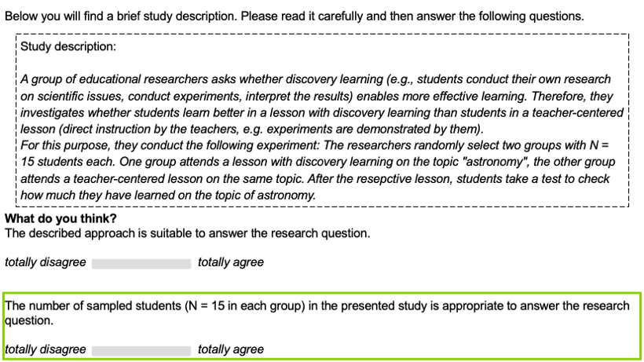

---
output:
  xaringan::moon_reader:
    css: xaringan-themer.css
    lib_dir: libs
    seal: false
    nature:
      highlightStyle: github
      highlightLines: true
      countIncrementalSlides: false
      ratio: "16:9"
---

name: title
class: center, middle, hide_logo

```{r, eval=FALSE, echo = F}
dir.create("style_file")
```

```{r xaringen-themer, echo=F, warning=FALSE, message=FALSE}
#install.packages("xaringan")
#install.packages("xaringanthemer")
#library(xaringanthemer)
#style_mono_light(
#  base_color = "#001c05",
#  header_font_google = google_font("Times New Roman"),
#  text_font_google   = google_font("Times New Roman", "300", "300i"),
#  code_font_google   = google_font("Fira Mono")
#)

#colors = c(
#  red = "#f34213",
#  purple = "#3e2f5b",
#  orange = "#ff8811",
#  green = "#136f63"
#)

library(xaringanthemer)
library(xaringanExtra)
library(readxl)
library(tidyverse)
library(ggalt)
library(hrbrthemes)
library(reactable)
htmltools::tagList(rmarkdown::html_dependency_font_awesome()) 

extra_css <- list(
  ".cit"  = list("font-size" = "70%",
                 "color" = "#6AEE3E90"),
  ".em05" = list("font-size" ="0.5em"),
  ".em06" = list("font-size" ="0.6em"),
  ".em07" = list("font-size" ="0.7em"),
  ".em08" = list("font-size" ="0.8em"),
  ".em09" = list("font-size" ="0.9em"),
  ".em11" = list("font-size" ="1.1em"),
  ".em12" = list("font-size" ="1.2em"),
  ".em13" = list("font-size" ="1.3em"),
  ".em14" = list("font-size" ="1.4em"),
  ".em15" = list("font-size" ="1.5em"),
  ".bold" = list("font-weight" = "bold"),
  ".medium" = list("font-size" = "130%"),
  ".large" = list("font-size" = "160%"),
  ".vertmiddle" = list("vertical-align" ="middle"),
  ".lh15" = list("line-height" =  "1.5"),
  ".lh16" = list("line-height" =  "1.6"),
  ".lh18" = list("line-height" =  "1.8"),
  ".li" = list("line-height" =  "1.5",
               "font-size" = "160%",
               "font-weight" = "bold"),
  ".phgreen" = list("color" = "#50B32E"), 
  ".phgreenlight" = list("color" = "#8CD000"),
  ".lightgrey" = list("color" ="#b3b3b3"),
  ".my-footer" = list("background-color" = "#1a1917",
                      "position" = "absolute",
                      "bottom" = "0px",
                      "left" = "0px",
                      "height" = "20px",
                      "width" = "100%"),
  ".my-footer span" = list("font-size" = "10pt", 
                           "color" = "#F7F8FA",
                           "position" = "absolute",
                           "left" = "15px",
                           "bottom" = "2px"),
  ".remark-slide-number" = list("bottom" = "18px"),
  ".li" = list("line-height" =  "4"),
  ".scroll-box-18" = list("height" ="18em",
                           "overflow-y" = "scroll"),
  ".scroll-box-23" = list("height" ="23em",
                           "overflow-y" = "scroll"))

style_mono_accent_inverse(
  #text_color = "#ffffff",
  base_color           = "#8CD000",
  white_color = "#FFFFFF",
  black_color = "#272822",
  header_font_google   = google_font("Roboto", "700"),
  text_font_google     = google_font("Roboto", "500"),
  code_font_google     = google_font("Droid Mono"),
  extra_css = extra_css#,
  #inverse_background_color = "#000000"
  #inverse_text_color = "#ffffff",
  #link_color = "#6AEE3E"
)

use_logo(
  image_url = "https://live.staticflickr.com/65535/50974533397_9ac99f9a48_o.png",
  width = "180px",
  position = css_position(top = "1.5em", right = "1.5em")
)

use_editable(expires = 1)
```

## .phgreenlight[Two Studies, one Result: Student Teachers are Biased by Anchors When Engaging With Evidence]
<br>

.em13[Kirstin Schmidt<sup>1</sup>.white[<sup>†</sup>], Kristina Bohrer<sup>1</sup><sup>†</sup> and Samuel Merk<sup>1</sup>]


<sup>1</sup> Karlsruhe University of Education <br>
<sup>†</sup> presenting authors <br>
<br>
<br>
<br>
<br>
<br>
.phgreen[Paper Presentation EARLI SIG 18 | 09.09.2022]  

???
@Samuel: Wie bekommen wir * anstelle der † ohne dass der Text italic wird?

---


## .phgreenlight[Structure `r fontawesome::fa_i(name = "list-ul")`]
* Evidence-Informed School Practice <i class="fas fa-school"></i>
* Anchoring Effects `r fontawesome::fa_i(name = "anchor")`
* Study 1: Anchoring Effects in  Engagement With Data <i class="fas fa-search"></i>
  * Research Question <i class="fas fa-question"></i>
  * Sample `r fontawesome::fa_i(name = "users")`
  * Design and Materials `r fontawesome::fa_i(name = "align-left")`
  * Results <i class="far fa-chart-bar"></i>
* Study 2: Anchoring Effects in Interpreting Scientific Evidence <i class="fas fa-search"></i>
  * Sample `r fontawesome::fa_i(name = "users")`
  * Design and Materials `r fontawesome::fa_i(name = "align-left")`
  * Results <i class="far fa-chart-bar"></i>
* Discussion <i class="fab fa-weixin"></i>
* References <i class="fas fa-book-open"></i>


---
class: inverse, center, middle

# Evidence-Informed School Practice <i class="fas fa-school"></i>

---
## .phgreenlight[Evidence-Informed School Practice <i class="fas fa-school"></i>]

* Teachers are encouraged to consider a great variety of .phgreenlight[evidence] ranging from .phgreenlight[formal or informal generated raw data] to .phgreenlight[results of educational research] in their professional actions (European Commission of the European Communities, 2007; Schildkamp, 2019).
<br>
<br>
* Both concepts, .phgreenlight[data-based decision-making] and .phgreenlight[research-informed educational practice], can be combined under the overarching approach of .phgreenlight[evidence-informed practice] (Brown et al., 2017; Brown et al., 2022).
<br>
<br>
* Advantages of DBDM (Mandinach & Schildkamp, 2021):
  * Individual data basis
  * Reactions to the subjective needs of the students as well as the specific school situations
  * ...
<br>
<br>
* Advantages of RIEP (Bromme et al., 2014; Flood & Brown, 2020; Stark, 2017):
  * As an external input
  * Critical reflection on professional actions
  * Legitimation and justification of decisions
  
  
???
* Advantages of RIEP
  - Because of research as an external input with higher objectiveness...
  - high credibility due to methodological conventions 
  
* Unfortunately there are some barriers making it harder for teachers to engage with evidence
 - like a lack of competences - data-literacy as well as research-literacy
 - not enough time during everyday practice
 - considering it as irrelevant, not useful, far away from their practical needs
* And there are some barriers concerning the correct interpretation, like cognitive biases

---
class: inverse, center, middle

# Anchoring Effects `r fontawesome::fa_i(name = "anchor")` 


---
## .phgreenlight[Anchoring Effects`r fontawesome::fa_i(name = "anchor")`]

*  a numeric judgment is assimilated to a previous known standard (Mochon & Frederick, 2013; Tversky & Kahneman, 1974)

---
class: inverse, center, middle

# Study 1: Anchoring Effects <br> in Engagement with Data <i class="fas fa-search"></i>

---

## .phgreenlight[Sample `r fontawesome::fa_i(name = "users")`]

<center> .phgreenlight[*N* = 68 student teachers from the Karlsruhe University of Education] </center>
<br>
<br>
* 70.59 % female student teachers
<br>
<br>
* M<sub>semesters</sub> = 4.73 (*SD* = 3.02)
<br>
<br>
* 69.12 % of the students studied at least one STEM subject

---

## .phgreenlight[Design and Materials `r fontawesome::fa_i(name = "align-left")`]

Randomized Controlled Trial with two experimental groups: .phgreenlight[*small anchor*] and .phgreenlight[*small to large anchor*]


???
- xx
- yy

---

## .phgreenlight[Design and Materials `r fontawesome::fa_i(name = "align-left")`]


     


???
- to-do@Marc: Screenshots übersetzen
- yy

---
## .phgreenlight[Hypotheses]

H<sub>1</sub>: The given .phgreen[sampling options] (small samples vs. small to large samples) .phgreen[influence as an anchor the size of the initial sampling] in the third virtual study. <br> 
<!-- Das ist übrigens die Kommentarfunktion :-) -->
<br>
<br>
H<sub>2</sub>: The given .phgreen[sampling options] (small samples vs. small to large samples) .phgreen[influence as an anchor the maximum sample size] in the third virtual study.

<br>

*<center> H<sub>1</sub>:  µ<sub>small samples</sub> < µ<sub>small to large samples</sub> <br> H<sub>2</sub>:  µ<sub>small samples</sub> < µ<sub>small to large samples</sub> </center>*

<br>
<br>
<br>
<br>

???
- xx
- yy


---
## .phgreenlight[Results]

.pull-left[

]

.pull-right[

]


???

---
class: inverse, center, middle

# Study 2: Anchoring Effects in <br> Interpreting Scientific Evidence <i class="fas fa-search"></i>


???

- in the second study we again analyzed anchoring effects, but this time we analyzed whether they influence student teachers' interpretation of scientific evidence or more specifically the appropriateness of the sample size

---

## .phgreenlight[Sample `r fontawesome::fa_i(name = "users")`]

<center> .phgreenlight[*N* = 233 student teachers from the Karlsruhe University of Education] </center>
<br>
<br>
* 85 % female student teachers
<br>
<br>
* M<sub>semesters</sub> = 3.36 (*SD* = 1.28)
<br>
<br>
* 70.81 % of the students studied at least one STEM subject


---

## .phgreenlight[Design and Materials `r fontawesome::fa_i(name = "align-left")`]

Randomized Controlled Trial with two within-person factors .phgreenlight[*topic of educational research*] and .phgreenlight[*sample size*]


???
- each participant presented with two study reports on different topics from educational research sequentially and in randomized order
- research reports: research question, drawn sample size and experimental design of the study 
- results were presented in a later step, but for the RQ today irrelevant 
- after participants have read the report, decided whether ‘the investigated sample size of students (either N = 15 or N = 500) in the presented study is appropriate to answer the research question’ using a Likert scale ranging from 1 = totally disagree to 7 = totally agree
- two experimental groups: N1 = 15 and N2 = 500 or reverse 
- two control groups: in both research reports the same sample size e.g., N1 = 15 und N2 = 15

---

## .phgreenlight[Design and Materials `r fontawesome::fa_i(name = "align-left")`]

Randomized Controlled Trial with two within-person factors .phgreenlight[*topic of educational research*] and .phgreenlight[*sample size*]



???
- after participants have read the report, decided, among others, whether ‘the investigated sample size of students (either N = 15 or N = 500) in the presented study is appropriate to answer the research question’ using a Likert scale ranging from 1 = totally disagree to 7 = totally agree
- two experimental groups: N1 = 15 and N2 = 500 or reverse 
- two control groups: in both research reports the same sample size e.g., N1 = 15 und N2 = 15

???

hier im Material dann auch statt adquate - appropriate schreiben?

neuer test 

---
## .phgreenlight[Hypothesis]

a) Taking into account the appropriateness rating of sample size 1, the .phgreen[experimental group 1] rates the presented .phgreen[sample size 2 as more appropriate] than the experimental group 2. <br> 
<!-- Das ist übrigens die Kommentarfunktion :-) --- jetzt klingt es so als würden beide die gleiche sample size 2 angezeigt bekommen -->
b) Taking into account the appropriateness rating of sample size 1, the .phgreen[experimental group 2] rates the presented .phgreen[sample size 2 as less appropriate] than the experimental group 1. <br> 
c) Taking into account the appropriateness rating of sample size 1, there is .phgreen[no difference in the appropriateness rating of sample size 2] between the .phgreen[control group 1 and control group 2].

<br>

*<center> H<sub>1</sub>:  µ<sub>exp.group1</sub> > µ<sub>exp.group2</sub> & µ<sub>con.group1</sub>=µ<sub>con.group2</sub> </center>*

<br>
<br>
<br>
<br>

experimental group 1 (exp.group1): N<sub>1</sub>=15 (small anchor), N<sub>2</sub>=500 <br>
experimental group 2 (exp.group2): N<sub>1</sub>=500 (large anchor), N<sub>2</sub>=15 <br>
control group 1 (con.group1): N<sub>1</sub>=15, N<sub>2</sub>=15 <br>
control group 2 (con.group1): N<sub>1</sub>=500, N<sub>2</sub>=500


???
b)  The student teachers rate the sample size 2 as less appropriate if first presented with a large sample size (N<sub>1</sub>=500) and afterwards with a small sample size (N<sub>2</sub>=15) than vice versa. <br>
wie formuliere ich das am besten als eine informative Hypothese

ahh hier fehlt die kontrolle 
---

class: hide_logo
background-image: url("images/study_two_results_differencevariable.png")
background-size: contain


???
- Frage an Samuel: passt die Skalierung?
- to analyze whether the sample size presented in the first report acted as an anchor for assessing the adequacy of the sample size in the second report, we subtracted the appropriateness rating of the first study sample from the appropriateness rating of the second one
---
class: inverse, center, middle

# Discussion <i class="fab fa-weixin"></i>

---
## .phgreenlight[Discussion <i class="fab fa-weixin"></i>]

* Both studies indicate evidence for anchoring effects on student teachers' engagement with different types of evidence 

Anchoring effects in data-based decision-making
* Benchmarks in Vergleichsarbeiten (e.g., assessments) might act as an anchor for interpreting the achievement of one's own students resulting in different teaching practices e.g., teaching to the test (Garner et al., 2017)


Anchoring effects in interpreting scientific evidence
* Large-scale assessments (e.g., PISA) might act as an anchor resulting in a devaluation of scientific evidence based on smaller sample sizes &rarr; sample sizes are not the only indicator of quality and validity

???

* vermeintliche Objektivität dieser Methoden, aber auch hier kommen Verzerrungen ins Spiel -> wichtig zu wissen, um darauf eingehen zu können und sie möglicherweise sogar positiv wenden zu können

Überlegungen für Rückfragen
- mediator
- limitations 
---
## .phgreenlight[References <i class="fas fa-book-open"></i>]

.em08[
Bromme, R., Prenzel, M., & Jäger, M. (2014). Empirische Bildungsforschung und evidenzbasierte Bildungspolitik. Zeitschrift für Erziehungswissenschaft, 17(4), 3–54. https://doi.org/10.1007/s11618-014-0514-5 <br>
Brown, C., Macgregor, S., Flood, J., & Malin, J. (2022). Facilitating Research-Informed Educational Practice for Inclusion. Survey Findings From 147 Teachers and School Leaders in England. Frontiers in Education, 7, 890832. https://doi.org/10.3389/feduc.2022.890832 <br>
Brown, C., Schildkamp, K., & Hubers, M. D. (2017). Combining the best of two worlds: A conceptual proposal for evidence-informed school improvement. Educational Research, 59(2), 154–172. https://doi.org/10.1080/00131881.2017.1304327 <br>
European Commission of the European Communities. (2007). Communication from the Commission to the Council and the European Parliament. Improving the Quality of Teacher Education (Nr. 392). https://eur-lex.europa.eu/legal-content/EN/TXT/PDF/?uri=CELEX:52007DC0392&from=EN <br>
Flood, J., & Brown, C. (2020). Exploring Teachers’ Conceptual Uses of Research as Part of the Development and Scale up of Research-Informed Practices. International Journal of Education Policy and Leadership, 16(10), Article 10. https://doi.org/10.22230/ijepl.2020v16n10a927 <br>
Mandinach, E. B., & Schildkamp, K. (2021). Misconceptions about data-based decision making in education: An exploration of the literature. Studies in Educational Evaluation, 69, 1–10. https://doi.org/10.1016/j.stueduc.2020.100842 <br>
Mochon, D., & Frederick, S. (2013). Anchoring in sequential judgments. Organizational Behavior and Human Decision Processes, 122(1), 69–79. https://doi.org/10.1016/j.obhdp.2013.04.002 <br>
Schildkamp, K. (2019). Data-based decision-making for school improvement: Research insights and gaps. Educational Research, 61(3), 257–273. https://doi.org/10.1080/00131881.2019.1625716 <br>
Stark, R. (2017). Probleme evidenzbasierter bzw. -Orientierter pädagogischer Praxis. Zeitschrift für Pädagogische Psychologie, 31(2), 99–110. https://doi.org/10.1024/1010-0652/a000201 <br>
Tversky, A., & Kahneman, D. (1974). Judgment under Uncertainty: Heuristics and Biases. Science, 185(4157), 1124–1131.
]

???
.em08[
Bromme, R., & Goldman, S. R. (2014). The public’s bounded understanding of science. Educational Psychologist, 49(2), 59–69. https://doi.org/10.1080/00461520.2014.921572 <br>
Bromme, R., Kienhues, D., & Porsch, T. (2010). Who knows what and who can we believe? Epistemological beliefs are beliefs about knowledge (mostly) to be attained from others. In L. D. Bendixen & F. C. Feucht (Eds.), Personal epistemology in the classroom (pp. 163–194). Cambridge University Press. https://doi.org/10.1017/CBO9780511691904.006 <br>
Brown, C., Schildkamp, K., & Hubers, M. D. (2017). Combining the best of two worlds: A conceptual proposal for evidence-informed school improvement. Educational Research, 59(2), 154–172. https://doi.org/10.1080/00131881.2017.1304327 <br>
Hoijtink, H., Mulder, J., van Lissa, C., & Gu, X. (2019). A tutorial on testing hypotheses using the Bayes factor. Psychological Methods, 24(5), 539–556.https://doi.org/10.1037/met0000201 <br>
Kühberger, A., Fritz, A., Lermer, E., & Scherndl, T. (2015). The significance fallacy in inferential statistics. BMC Research Notes, 8(1), 84. https://doi.org/10.1186/s13104-015-1020-4 
]

---

## .phgreenlight[Referenzen <i class="fas fa-book-open"></i>]

.em08[
...
]
---
class: inverse, center, middle

# Thank you for your attention!
contacts `r fontawesome::fa_i(name = "address-card")`:
.pull-left[
Kirstin Schmidt <br>
Karlsruhe University of Education <br>
Bismarckstraße 10, <br>
76133 Karlsruhe <br>
Germany <br>
.white[kirstin.schmidt@ph-karlsruhe.de] 
] 

.pull-right[
Kristina Bohrer <br>
Karlsruhe University of Education <br>
Bismarckstraße 10, <br>
76133 Karlsruhe <br>
Germany <br>
.white[kristina.bohrer@ph-karlsruhe.de] 
]
